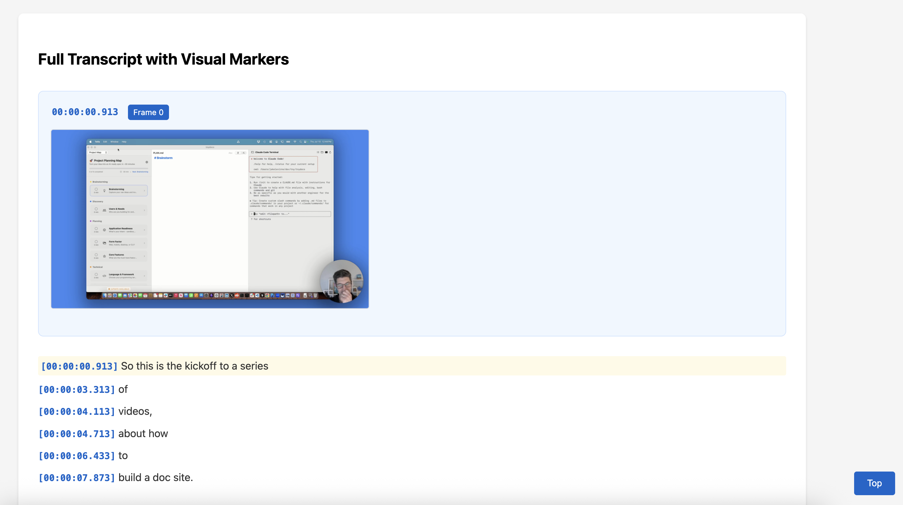

# Keyframe Blogger

Convert instructional videos into blog posts by extracting key frames and using AI for content generation.


## Overview

This project processes videos through three steps:
1. **Frame Extraction**: Extract key frames based on transcript analysis
2. **Visual Summary**: Create HTML/Markdown previews with frames + transcript
3. **AI Blog Generation**: Use Gemini to create a polished blog post

## Prerequisites

- Python 3.8+
- MP4 video file + matching SRT transcript (e.g., from Tella)
- FFmpeg installed locally
- Google Cloud account (for AI processing)

## Setup

1. **Install dependencies**:
   ```bash
   python -m venv venv
   source venv/bin/activate
   pip install google-cloud-aiplatform
   ```

2. **Install FFmpeg** (if not already installed):
   ```bash
   # macOS
   brew install ffmpeg
   
   # Ubuntu/Debian
   sudo apt-get install ffmpeg
   
   # Windows
   # Download from https://ffmpeg.org/download.html
   ```

3. **Configure Google Cloud** (for AI processing):
   - Create a Google Cloud project
   - Enable the Vertex AI API
   - Set up authentication:
     ```bash
     gcloud auth application-default login
     ```
   - Set environment variables:
     ```bash
     export GOOGLE_CLOUD_PROJECT="your-project-id"
     ```

## Workflow

### 1. Organize Your Video Files

Create a directory for your video project and add your files:

```bash
# Create project directory
mkdir building-a-mintlify-alternative-with-AI-Part-1

# Copy your Tella exports
cp your-video.mp4 building-a-mintlify-alternative-with-AI-Part-1/
cp your-video.srt building-a-mintlify-alternative-with-AI-Part-1/
```

### 2. Extract Frames

```bash
python extract_frames.py building-a-mintlify-alternative-with-AI-Part-1
```

**What it does**:
- Automatically finds MP4 and SRT files in the directory
- Parses SRT to identify complete thoughts (sentences ending with `.`, `?`, `!`)
- Extracts frames at semantically meaningful moments:
  - When a complete sentence/thought is expressed
  - At least 5 seconds apart (to avoid redundancy)
  - OR when important content appears (text > 50 characters)

**Options**:
- `--interval 5.0` - Minimum seconds between frames (default: 5.0)

**Output** (in `building-a-mintlify-alternative-with-AI-Part-1/frames/`):
- Frame images (`frame_0000.jpg`, `frame_0001.jpg`, etc.)
- `frame_data.json` - Frame metadata with timestamps
- `all_subtitles.json` - Complete parsed transcript

### 3. Create Visual Summaries

```bash
python create_visual_summary.py building-a-mintlify-alternative-with-AI-Part-1
```



**What it does**:
- Checks if frames exist (runs extract_frames.py automatically if needed)
- Creates visual representations of your video content
- Uses directory name as the video title

**Output** (in the `frames/` subdirectory):
1. **visual_transcript.html** - Interactive web page with:
   - Full transcript with embedded frame images
   - Table of contents for navigation
   - Clickable images for full-screen view

2. **visual_transcript.md** - Markdown version with:
   - Full transcript with frame markers
   - Embedded images at correct timestamps

3. **api_frame_data.json** - API-ready format with:
   - Segmented transcript (text between frames)
   - Frame metadata and paths
   - Full transcript as single string

### 4. Generate Blog Post with AI

```bash
python process_with_ai.py building-a-mintlify-alternative-with-AI-Part-1
```

**Options**:
- `--max-frames` - Limit frames if needed (default: use all frames)
- `--model` - Model choice (default: gemini-2.5-pro)
- `--prompt` - Path to custom blog prompt markdown file (default: BLOG_PROMPT.md in current directory)

**Examples**:
```bash
# Use all frames with Gemini 2.5 Pro (recommended)
python process_with_ai.py building-a-mintlify-alternative-with-AI-Part-1

# Use a faster model with limited frames
python process_with_ai.py building-a-mintlify-alternative-with-AI-Part-1 --model gemini-2.0-flash-exp --max-frames 50

# Use a custom blog prompt file
python process_with_ai.py building-a-mintlify-alternative-with-AI-Part-1 --prompt custom_prompt.md
```

**What it does**:
- Loads blog writing style from `BLOG_PROMPT.md` (default) or custom prompt file
- Sends all frames + full transcript to Gemini 2.5 Pro
- Generates blog post named after your directory
- Analyzes which frames are referenced in the generated blog
- Copies only referenced frames to the output directory
- Updates image paths in the blog to point to local copies

**Output Structure**:
```
building-a-mintlify-alternative-with-AI-Part-1/
└── output/
    ├── building-a-mintlify-alternative-with-AI-Part-1.md  # Blog post
    └── building-a-mintlify-alternative-with-AI-Part-1/    # Referenced frames only
        ├── frame_0006.jpg
        ├── frame_0142.jpg
        └── ...
```

## Example Directory Structure

After processing, your project directory will look like:

```
building-a-mintlify-alternative-with-AI-Part-1/
├── your-video.mp4
├── your-video.srt
├── frames/
│   ├── frame_0000.jpg
│   ├── frame_0001.jpg
│   ├── ...
│   ├── frame_data.json
│   ├── all_subtitles.json
│   ├── visual_transcript.html
│   ├── visual_transcript.md
│   └── api_frame_data.json
└── output/
    ├── building-a-mintlify-alternative-with-AI-Part-1.md
    └── building-a-mintlify-alternative-with-AI-Part-1/
        ├── frame_0006.jpg  # Only referenced frames
        ├── frame_0142.jpg
        └── ...
```

## Frame Selection Logic

The script captures frames at moments when:
- A complete thought or sentence has been expressed
- Enough time has passed to avoid similar frames (default: 5 seconds)
- OR when there's particularly important/lengthy content (>50 characters)

This ensures frames are captured at **semantically meaningful moments** rather than fixed intervals.

## Customization

### Adjust Frame Extraction Interval

```bash
# Extract frames with 10-second minimum interval
python extract_frames.py your-directory --interval 10.0
```

### Process Multiple Videos

Simply create separate directories for each video:

```bash
python extract_frames.py video-project-1
python extract_frames.py video-project-2
python create_visual_summary.py video-project-1
python create_visual_summary.py video-project-2
python process_with_ai.py video-project-1
python process_with_ai.py video-project-2
```

### Customize Blog Writing Style

Edit `BLOG_PROMPT.md` to adjust:
- Writing tone and style
- Section structure
- Technical detail level
- Image usage guidelines

## Benefits

1. **Cost Efficiency**: 
   - Process hour-long videos for pennies instead of dollars
   - Only send key frames to AI (not entire video)
   - Leverage Gemini 2.5 Pro's large context window

2. **Flexibility**:
   - Work with any video + SRT combination
   - Adjust frame selection criteria
   - Process locally without API limits

3. **Quality**:
   - Frames captured at meaningful moments
   - Full transcript preserved
   - Visual + text context for better AI understanding

## Tips

- Name your directories descriptively (they become the blog title)
- Keep MP4 and SRT filenames consistent for easier management
- Review the HTML preview before generating the blog post
- The blog prompt can be customized in `BLOG_PROMPT.md`
- Only frames referenced in the blog are copied to output (saves space)
- Frame numbering starts at 0 (Frame 0, Frame 1, etc.)

## File Structure

Key files in this project:
- `extract_frames.py` - Extracts frames from video based on transcript
- `create_visual_summary.py` - Creates HTML/MD previews
- `process_with_ai.py` - Generates blog post using Gemini
- `BLOG_PROMPT.md` - Defines blog writing style (shared across all videos)

---

<div align="center">
  <a href="https://bearclaude.specstory.com">
    
    <br>
    Made with BearClaude
  </a>
</div>